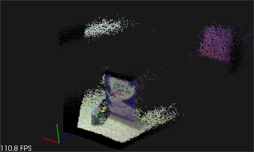

This is a [PCL][] grabber for DepthSense devices (e.g. [Creative Senz3D][],
[SoftKinetic DS325][]) that supports both Linux and Windows versions of the
[SDK][].

**Note:** the grabber [has been merged][PR1230] into upstream PCL and will be a
part of the next release (1.8.0). This repository is kept only for historical
reasons.

Requirements
============

1. Point Cloud Library 1.7.2

2. [SoftKinetic DepthSense SDK][SDK]

Installation
============

Linux
-----

1. Clone the repository:

   ```bash
   git clone https://github.com/taketwo/ds.git ds
   cd ds
   ```

2. Copy the contents of `third-party/compatibility` to the `lib` directory of
   the SDK installation. For example, assuming that SDK was installed in
   `/opt/softkinetic/DepthSenseSDK` (default), do:

   ```bash
   sudo cp third-party/compatibility/* /opt/softkinetic/DepthSenseSDK/lib/
   ```

3. Configure and build the project:

   ```bash
   mkdir build
   cd build
   cmake -DBUILD_TYPE=Release ..
   make depth_sense_viewer
   ```

Windows
-------

1. Clone the repository.
2. Configure this project using `cmake-gui`.
3. Open and build the created Visual Studio solution.

Depth Sense Viewer
==================

Connect a DepthSense camera and run the `depth_sense_viewer` executable.



Run with `--help` option to see the usage guide:

```
****************************************************************************
*                                                                          *
*                       DEPTH SENSE VIEWER - Usage Guide                   *
*                                                                          *
****************************************************************************

Usage: ./depth_sense_viewer [Options] device_id

Options:

     --help, -h : Show this help
     --list, -l : List connected DepthSense devices
     --xyz      : View XYZ-only clouds

Keyboard commands:

   When the focus is on the viewer window, the following keyboard commands
   are available:
     * t/T : increase or decrease depth data confidence threshold
     * k   : enable next temporal filtering method
     * b   : toggle bilateral filtering
     * a/A : increase or decrease bilateral filter spatial sigma
     * z/Z : increase or decrease bilateral filter range sigma
     * s   : save the last grabbed cloud to disk
     * h   : print the list of standard PCL viewer commands

Notes:

   The device to grab data from is selected using device_id argument. It
   could be either:
     * serial number (e.g. YZVF0780239000261D)
     * device index (e.g. #2 for the second connected device)

   If device_id is not given, then the first available device will be used.
```

[PCL]: http://www.pointclouds.org
[Creative Senz3D]: http://de.creative.com/p/web-cameras/creative-senz3d
[SoftKinetic DS325]: http://www.softkinetic.com/language/fr-BE/Products/DepthSenseCameras
[SDK]: http://www.softkinetic.com/support/download.aspx
[PR1230]: https://github.com/PointCloudLibrary/pcl/pull/1230
